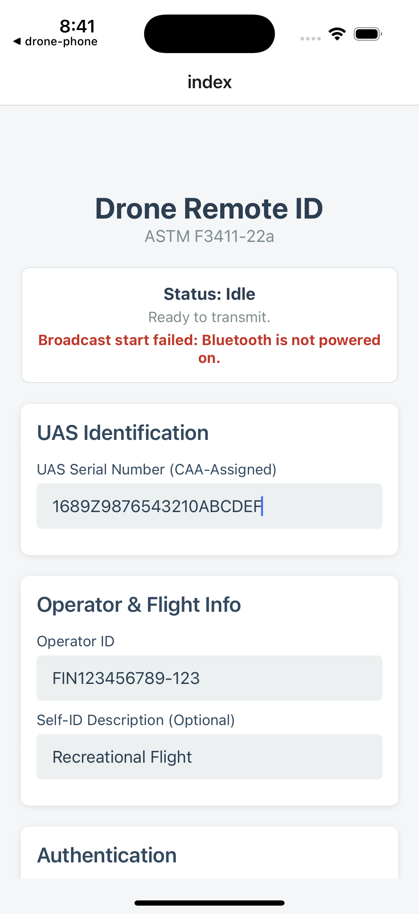
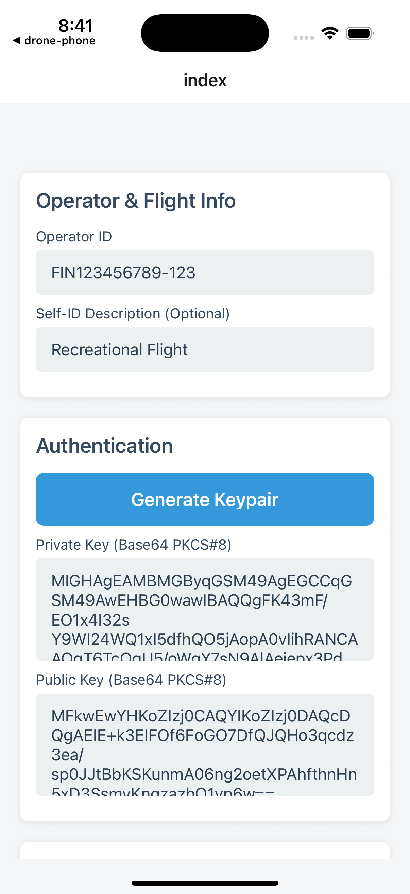
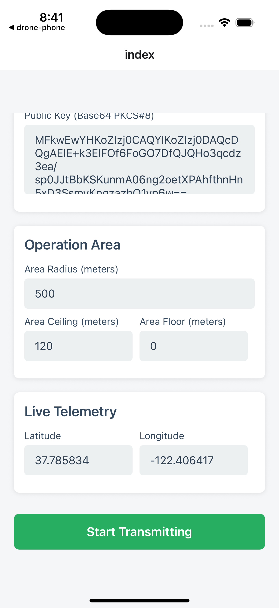

# Drone Phone - Drone Reuse Project

This project aims to allow older drones to be renovated to meet broadcasting requirements without expensive Remote ID modules. This can prevent good equipment from going to waste and support basic, low-range flights for filming and testing purposes. Drones should be tested for compliance by pilots before attemtping to launch using software or hardware related to this project.

### Compatible Phone Mounts
- https://cults3d.com/en/3d-model/tool/dji-phantom-3-phone-mount

iPhone 16 (Home - 1)             |  (Home - 2)
:-------------------------:|:-------------------------:
  |  



# Welcome to your Expo app 👋

This is an [Expo](https://expo.dev) project created with [`create-expo-app`](https://www.npmjs.com/package/create-expo-app).

## Get started

1. Install dependencies

   ```bash
   npm install
   ```

2. Start the app

   ```bash
   npx expo start
   ```

3. Generate native code

  ### Android + IOS
   ```bash
   npx expo prebuild --platform all
   ```

   ### Android
   ```bash
   npx expo prebuild --platform android
   ```

   ### IOS
   ```bash
   npx expo prebuild --platform ios
   ```

4. Link libraries

   ```bash
   cd android
   ```
   OR
   ```bash
   cd ios
   ```

   ```bash
   pod install
   ```

In the output, you'll find options to open the app in a

- [development build](https://docs.expo.dev/develop/development-builds/introduction/)
- [Android emulator](https://docs.expo.dev/workflow/android-studio-emulator/)
- [iOS simulator](https://docs.expo.dev/workflow/ios-simulator/)
- [Expo Go](https://expo.dev/go), a limited sandbox for trying out app development with Expo

You can start developing by editing the files inside the **app** directory. This project uses [file-based routing](https://docs.expo.dev/router/introduction).

## Get a fresh project

When you're ready, run:

```bash
npm run reset-project
```

This command will move the starter code to the **app-example** directory and create a blank **app** directory where you can start developing.

## Learn more

To learn more about developing your project with Expo, look at the following resources:

- [Expo documentation](https://docs.expo.dev/): Learn fundamentals, or go into advanced topics with our [guides](https://docs.expo.dev/guides).
- [Learn Expo tutorial](https://docs.expo.dev/tutorial/introduction/): Follow a step-by-step tutorial where you'll create a project that runs on Android, iOS, and the web.

## Join the community

Join our community of developers creating universal apps.

- [Expo on GitHub](https://github.com/expo/expo): View our open source platform and contribute.
- [Discord community](https://chat.expo.dev): Chat with Expo users and ask questions.

# Learn more https://docs.github.com/en/get-started/getting-started-with-git/ignoring-files